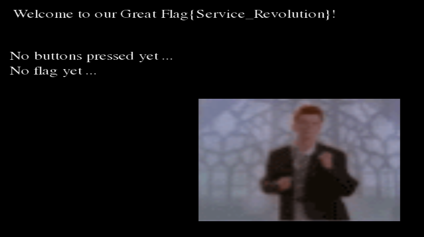
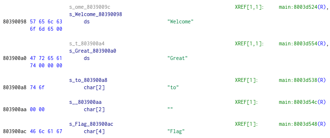
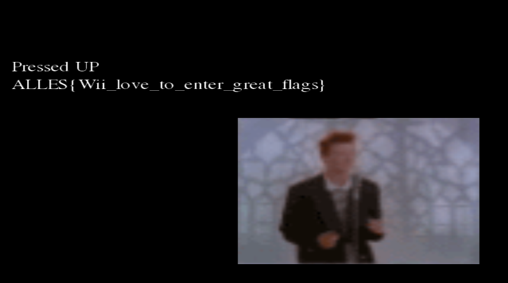

# Flag Service Revolution
We are given a 7-zip file containing 3 files. `boot.dol`, `main.xml` and `....png`. I happen to know that this is the typical structure of a Wii homebrew application. Among these files, `boot.dol` is the executable and we can run it for example using [Dolphin](https://dolphin-emu.org/). Alternatively, we could run it on a real Wii using the [Homebrew Launcher](https://wiibrew.org/wiki/Wii_Homebrew_Launcher), but since it's harder to take screenshots from that, I went with Dolphin. We can safely ignore the other two files, since they just contain some unimportant metadata. 

When we open the game, we are greeted by none other than Rick Astley:



Other than a short loop of Rick Astley dancing, we have a welcome text and two lines. One shows the most recently pressed button, the other shows the flag once we get it. Because of this, we're likely supposed to press buttons in a specific order, kind of like the [konami code](https://en.wikipedia.org/wiki/Konami_Code). Unfortunately, the konami code doesn't work.

To find out what the actual sequence is that gives us the flag, we're going to load the `.dol` file into Ghidra. We can also give ourselves a head start by letting Dolphin recognise some basic functions. To do this, make sure Dolphin runs in debug mode (add the `-d` command line argument). When you have opened the game, go to the main window's menu and click `Symbols > Generate Symbols From > Signature Database`. A popup should appear saying `Generated symbol names from 'totaldb.dsy'`. Next, export the symbols by going to `Symbols > Save Symbol Map As` and save the `.map` file that contains the symbols somewhere.

Next, we load `boot.dol` in Ghidra. To do this, we should install the [language definition](https://github.com/aldelaro5/ghidra-gekko-broadway-lang) and a [loader extension](https://github.com/Cuyler36/Ghidra-GameCube-Loader). The instructions on how to install them are provided on the pages linked to. Make sure to select `Nintendo GameCube Binary` when loading the `.dol` file, and when asked to import symbols, select the `.map` file exported from Dolphin.

When we have succesfully loaded the `boot.dol` file, it is not immediately clear what the main function is. In such cases, it's often beneficial to look for strings. By looking for `'Welcome'` in the `Defined Strings` tab, we find only one string.



From the surrounding strings, it is clear that strings are split up in separate substrings and then later combined before being drawn to the screen. The `Welcome` string has only one XREF, so we follow that and we find that we end up in a function that has a big infinite loop at the end. As such, it is safe to say that this function is the main function.

Looking at the decompilation of the loop body, we see an extensive `if` / `else if` chain in the middle. Afterwards, 4 function calls are made and the next iteration starts. There are two ways to find out what these functions do. The hardest is to follow the functions, look at the disassembly and try to figure out what they do. The easier option is to just "comment out" the function calls, run the game and observe what changed.

Naturally, I chose the second option. It is pretty easy to replace a function call by a `nop` instruction (`nop` stands for no-operation: do nothing) using Dolphin's debug mode. This debug mode can be activated by launching Dolphin with the `-d` flag.

For example, suppose we want to figure out what the first function call after the chain of `if` / `else if`s does. Then, we look up the address of the function call in Ghidra (`0x8003d7d4` in this case). Next, we make sure the game is paused and Dolphin shows the code tab (you can toggle that in `View > Code`). Then, in the `Search address` field, we enter the address that we just found. Finally, we right-click the `bl` instruction and select `Insert nop`. Then, we press `Play` again and we observe the change. In this case, the animated image of Rick disappears, so we can conclude that this function is responsible for drawing this image.

The next two function calls actually call the same function. Using the technique described above, we find that the first function writes the button text to the screen and the second writes the flag text. Especially this second call is interesting. The arguments to these two calls are mostly the same, so we can easily deduce that the string to be written is in `r6`. Ghidra initially had some problems with this function's signature, so I hardcoded it to have 4 arguments stored in `r3-r6` (this can be deduced from the assembly just before the function call). Now, the variable that is loaded into `r6` shows up as the last argument. I renamed this to `flag_status_text`.

To find the flag, we should look at when this variable is updated. We see that this happens in one of the branches of the `if` / `else if` chain. Now, Ghidra is not too great at clearly displaying such chains, so I copied Ghidra's decompilation and cleaned it up.

Using the `nop` technique described earlier, we find the purpose of some more functions. For example, the last function call before the `if` encapsulating the `if` / `else if` chain returns the buttons that are held for a specified controller. The first function inside the outer `if` takes these button presses and writes them to the `button_press_text` variable in a human-readable form. From this function, we also find that the `presses` variable is a bitfield, and we can deduce what bits correspond to what buttons. It turns out that after this call, the big `if` / `else if` can probably best be represented by a `switch` statement. The variable that it checks is some kind of `stage` identifier. This variable starts out as `0`, and the `flag_status_text` variable gets updated when the `stage` is `9`. As the full decompilation is quite large, I included just the relevant code for stage 6 below. A more complete decompilation is given at the end of the writeup.

```C++
    enum WPAD presses = get_held_buttons(0);
    // ...
    switch(stage) {
        // ...
        case 6: {
            if ((presses & DOWN) != NONE) {
                // ...
                stage = 7;
            } else {
                do_reset(&stage, presses);
            }
            break;
        }
        // ...
    }
```

We can increment the `stage` variable by pressing the correct buttons. The sequence can easily be deduced from the decompiled code: `A B Right Left Right Left Down Down Up Up`. Pressing the buttons in this order changes the flag status and the screen changes to show the flag: `ALLES{Wii_love_to_enter_great_flags}`.



**BONUS:**
- If you take a close look at the decompiled code, you notice case `9` is not symmetic with case `8`: it doesn't have the call to `do_reset` when the wrong button is pressed. This means that once you end up in stage `9`, you can never leave it. This means that there are infinitely many sequences that lead to the flag. They all start with the same 8 button presses, but then you can press whatever buttons, as long as you eventually press `Up` again, the flag is shown.
- The code is actually the reverse of the Konami code. This code is `A B R L R L D D U U`, whereas the Konami code is `U U D D L R L R B A`.

**Decompilation**
```C++
enum WPAD get_held_buttons(int controller_id);
void* write_button_presses(enum WPAD presses, char* text);
void write_text(void* buffer, uint32_t x, uint32_t y, char* text);

// This function is actually inlined. I took it out to avoid GOTO statements and
// make the code easier to read.
inline void do_reset(uint32_t* stage, enum WPAD presses) {
    *stage = 0;
    if ((presses & A) != NONE) {
        *stage = 1;
        // ...
    }
}

void main() {
    // stuff...

    uint32_t stage = 0;
    char button_press_text;
    char* flag_status_text = "No flag yet...";
    char flag;

    while (true) {
        // ...

        enum WPAD presses = get_held_buttons(0);

        if (presses != NONE) {
            write_button_presses(presses, &button_press_text);

            switch (stage) {
                case 0: {
                    do_reset(&stage, presses);
                    break;
                }
                case 1: {
                    if ((presses & B) != NONE) {
                        // ...
                        stage = 2;
                    } else {
                        do_reset(&stage, presses);
                    }
                    break;
                }
                case 2: {
                    if ((presses & RIGHT) != NONE) {
                        // ...
                        stage = 3;
                    } else {
                        do_reset(&stage, presses);
                    }
                    break;
                }
                case 3: {
                    if ((presses & LEFT) != NONE) {
                        // ...
                        stage = 4;
                    } else {
                        do_reset(&stage, presses);
                    }
                    break;
                }
                case 4: {
                    if ((presses & RIGHT) != NONE) {
                        // ...
                        stage = 5;
                    } else {
                        do_reset(&stage, presses);
                    }
                    break;
                }
                case 5: {
                    if ((presses & LEFT) != NONE) {
                        stage = 6;
                    } else {
                        do_reset(&stage, presses);
                    }
                    break;
                }
                case 6: {
                    if ((presses & DOWN) != NONE) {
                        // ...
                        stage = 7;
                    } else {
                        do_reset(&stage, presses);
                    }
                    break;
                }
                case 7: {
                    if ((presses & DOWN) != NONE) {
                        // ...
                        stage = 8;
                    } else {
                        do_reset(&stage, presses);
                    }
                    break;
                }
                case 8: {
                    if ((presses & UP) != NONE) {
                        // ...
                        stage = 9;
                    } else {
                        do_reset(&stage, presses);
                    }
                    break;
                }
                case 9: {
                    if ((presses & UP) != NONE) {
                        // ...
                        flag_status_text = &flag;
                    }
                    break;
                }
            }
        }

        // ...

        write_text(/* ... */ &button_press_text);
        write_text(/* ... */ flag_status_text);

        // ...
    }
}
```
